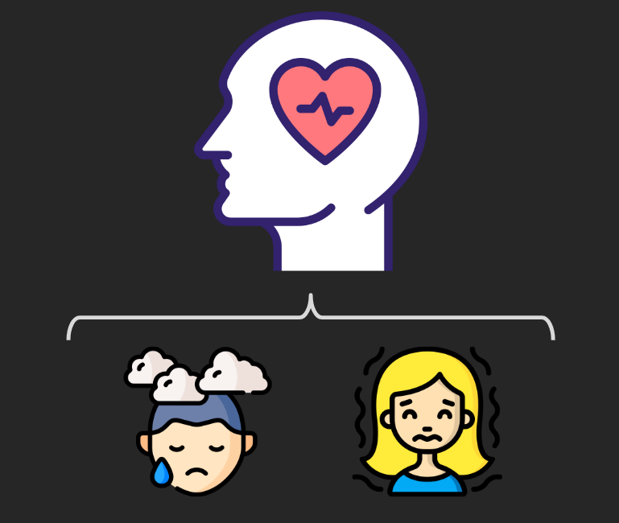
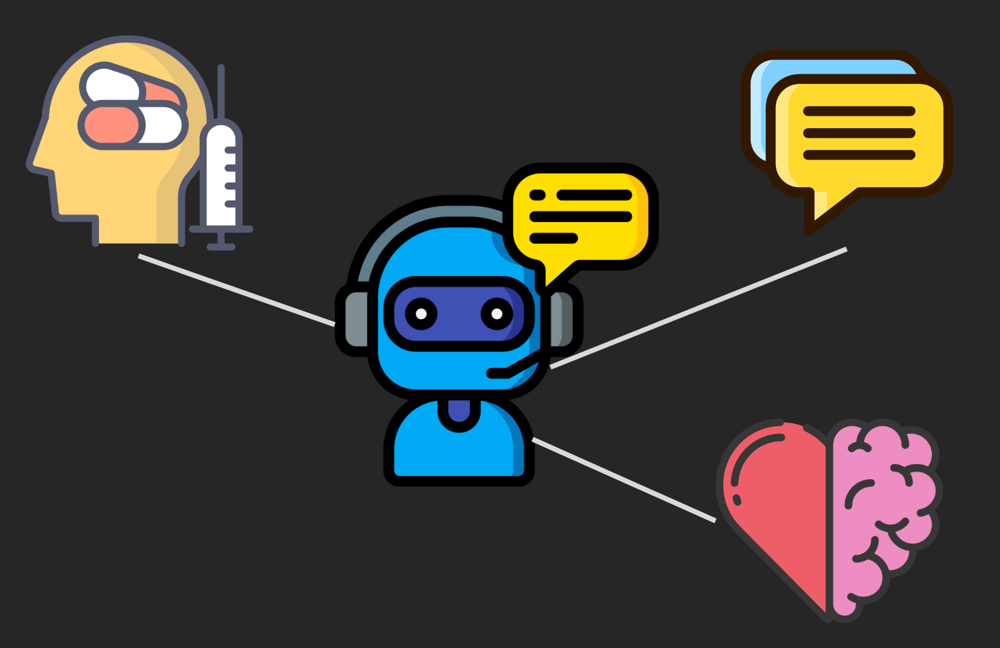

# Global Solution - 2° Semestre - Python - SereniBOT
 

**Nomes + RM dos integrantes:**

- Matheus Motta - 550352
- Vinicius Buzato - 99125

**Turma:** 1ESPW

**Ano:** 2023
___

### O Projeto
SereniBOT é um assistente virtual dedicado a oferecer apoio para aqueles que lidam com a depressão e ansiedade. Ele é um companheiro digital projetado para proporcionar suporte emocional e orientação. Através de conversas empáticas e personalizadas, o SereniBOT está aqui para oferecer alívio e ajudar a entender e lidar com os desafios das doenças mentais.

___

### Funções Principais
O SereniBOT atua como um chatbot responsivo capaz de reproduzir mensagens em reposta aos inputs do usuário. Através do uso de dicionários, listas, funções, inputs e validações, o programa é capaz de fornecer uma resposta adequada a uma frase digitada, emulando assim uma conversa entre usuário e máquina.

___

### Função Chatbot:
A função Chatbot é a principal função do programa. Através da uma validação dos dicionários introduzidos, o programa é capaz de coletar uma entrada de dados do usuário e fornecer uma resposta de acordo, uma vez que essa entrada de dados já foi previamente armazenada em um dicionário, junto com suas possíveis respostas.

O programa atualmente consta com uma base experimental de perguntas e possíveis repostas, implementadas pra ilustar a concepção do projeto. Novas interações podem ser facilmente acrescentadas ao expandir os dicionários utilizados na função.
___

### Arquivos Externos
Sempre que um usuário faz uso do programa e menciona ao Chatbot que "não está bem", ele gera e atualiza um arquivo externo com a data e horário dessa constatação. O ojetivo do armazenamento desse dado é tornar o robô capaz de, futuramente, encaminhar esses dados de quando a pessoa não estava bem para um psicólogo ou profissional de saúde que esteja cuidando do tratamento do usuário.

Assim, é possível fazer um monitoramento mais detalhado do estado mental da pessoa, e ajustar seu tratamento de acordo, visando um melhor rendimento.
___

### Reprodução do Projeto
Para reproduzir o projeto, basta acessar um ambiente de desenvolvimento integrado (IDE) que tenha portabilidade para a linguagem de programação Python (como por exemplo o [Visual Studio Code](https://code.visualstudio.com), inserir o [código](script.py) aqui presente e executar.
___

### Resultados esperados e impactos
O objetivo do nosso projeto é garantir que as pessoas que enfrentam diariamente os disturbios montais mencionados, e garantir uma oportunidade de tratamento e melhora para essas pessoas. Dessa forma, um estilo de vida mais saudável e agradável passa a ser acessível a uma parcela maior da população, caminhando assim para uma melhor qualidade de vida em geral.
___

### Conhecer Mais sobre o Projeto
Para conhecer mais sobre o projeto, você pode acessar o nosso [website](https://gs---chatbotdepressao.web.app)
___

### Links Referênciais
  [Link para o vídeo explicativo do projeto no Google Drive](https://drive.google.com/file/d/1FRL0DYbdf_lZA3VVLezCz0-VFfhisSBV/view?usp=sharing)
